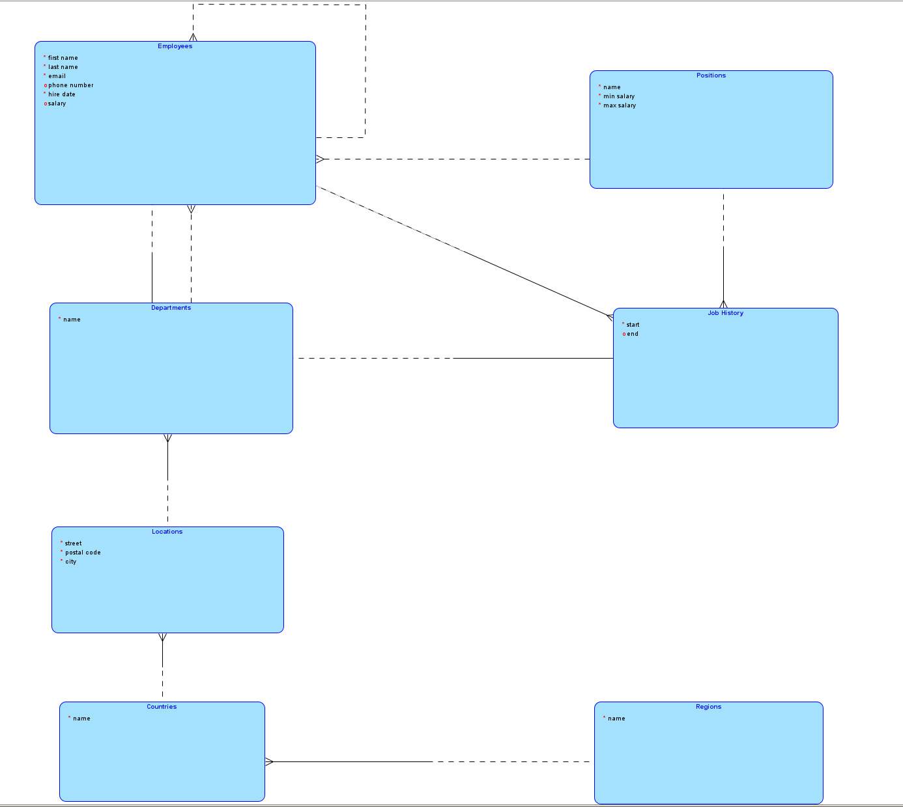
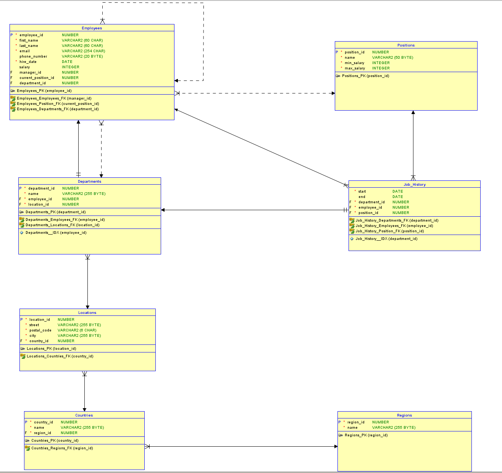

# Bazy Danych - Laboratorium 1

### Student:

    Bartłomiej Krawczyk

### Numer Albumu:

    310774

## Model ER

## Model Relacyjny

## Pytania

### 1. Czy encja może wchodzić w związek sama z sobą?

    - tak
    - przykładowo -> pracownik może mieć menadżera

### 2. Czy może istnieć więcej niż jeden związek między tymi samymi encjami?

    - tak

### 3. Czy w modelu relacyjnym możliwy jest związek n-n?

    - nie
    - jedna relacja n-n w modelu relacyjnym zamieniana jest na dwa związki 1-n

### 4. Czy w modelue ER projektujemy klucze główne i klucze obce?

    - nie
    - (program wykonuje to za nas)

### 5. Czy związek znaczy to samo co relacja w kontekście modelowania bazy danych?

    - są to bliźniacze pojęcia, lecz nie znaczą tego samego
