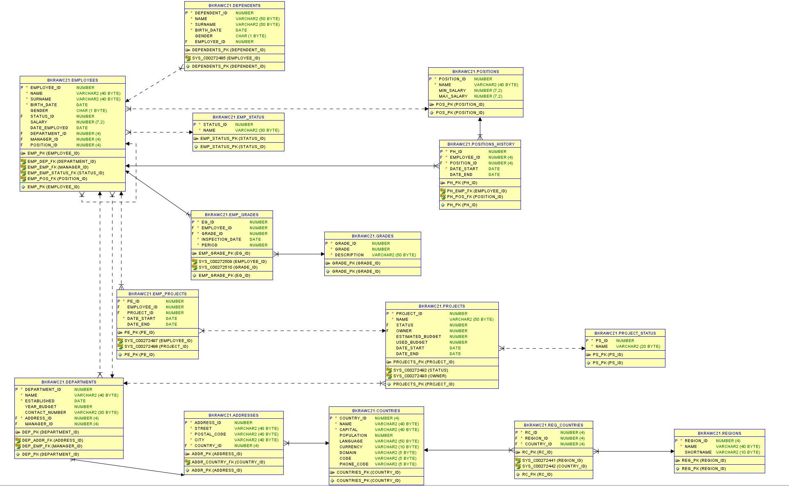
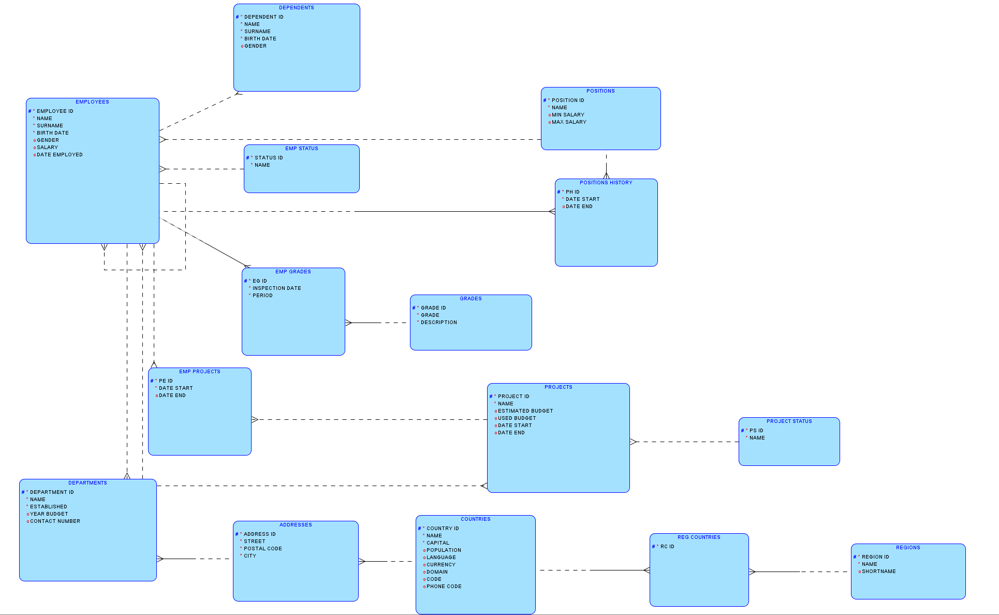

# Bazy Danych - Laboratorium 3

### Student:

    Bartłomiej Krawczyk

### Numer Albumu:

    310774

## Pytania

### 1. W Data Modelerze odtwórz model relacyjny i ER utworzonego schematu.





### 2. Wykonaj wszystkie polecenia z zajęć.

```sql
-- Wprowadź dane do tabel regions (Regiony) (2 wiersze), countries (Kraje) (1 wiersze), reg_countries (tabela posrednia) (2 wiersze)

INSERT INTO regions (name, shortname)
VALUES ('Europe', 'EU');

INSERT INTO regions (name, shortname)
VALUES ('Asia', 'A');


INSERT INTO countries (name, capital)
VALUES ('Russia', 'Moscow');

INSERT INTO reg_countries (country_id, region_id)
VALUES (
(SELECT c.country_id FROM countries c WHERE c.name = 'Russia' AND c.capital = 'Moscow' AND ROWNUM = 1),
(SELECT r.region_id FROM regions r WHERE r.name = 'Europe' AND r.shortname = 'EU' AND ROWNUM = 1)
);

INSERT INTO reg_countries (country_id, region_id)
VALUES (
(SELECT c.country_id FROM countries c WHERE c.name = 'Russia' AND c.capital = 'Moscow' AND ROWNUM = 1),
(SELECT r.region_id FROM regions r WHERE r.name = 'Asia' AND r.shortname = 'A' AND ROWNUM = 1)
);

-- Wprowadź dane nieprawidłowe (niezachowanie więzów referencyjnych, duplikaty kluczy, niepoprawne typy danych etc). Obserwuj komunikaty błędów.

INSERT INTO regions (region_id)
VALUES ('cztery');

INSERT INTO regions (region_id, name) VALUES (1, 123);
INSERT INTO regions (region_id, name) VALUES (1, 'Europa');

-- Zmodyfikuj nazwy wszystkich krajów na ‘NIEZNANY’

UPDATE countries
SET
    name = 'UNKNOWN';

-- Ustaw wszystkim pracownikom pole kierownik na wartość pustą.

UPDATE employees
SET
    manager_id = NULL;

-- Usuń dane z tabeli countries.

DELETE FROM reg_countries;

DELETE FROM countries;


-- Usuń dane z tabeli addresses bez usuwania tabeli (na 2 sposoby).
UPDATE employees
SET
    department_id = NULL;
UPDATE projects
SET
    owner = NULL;
DELETE FROM departments;
DELETE FROM addresses;

ROLLBACK;

UPDATE employees
SET
    department_id = NULL;
UPDATE projects
SET
    owner = NULL;
DELETE FROM departments;
TRUNCATE TABLE addresses;

ROLLBACK;

-- sprawdź aktualny format daty

SELECT value
FROM nls_session_parameters
WHERE parameter = 'NLS_DATE_FORMAT';

-- zmień format na ustalony

ALTER SESSION SET nls_date_format = 'DD/MM/YY';

-- sprawdź jak formatuje się data aktualna

SELECT SYSDATE
FROM dual;

-- Wylistuj wszystkie dane z tabeli departments.

SELECT * FROM departments;

-- Wylistuj wybrane 3 kolumny z tabeli departments. W jakiej kolejności się pojawią?

SELECT department_id, address_id, name FROM departments;

-- Zmodyfikuj poprzednie zapytanie tak, aby nazwa zakładu pojawiła się wielkimi literami. Czy ma to wpływ na zawartość tabeli?

SELECT department_id, address_id, UPPER(name) FROM departments;

-- Pokaż id, imię i nazwisko pracowników ich wynagrodzenie oraz przewidywana wartość miesięcznych podatków przez nich płaconych (23%).
-- Zastosuj alias na kolumnę z podatkiem.

SELECT employee_id, name, surname, 0.23 * salary TAX FROM employees;

-- Ilu jest wszystkich pracowników?

SELECT count(*) FROM employees;

-- Wylistuj wszystkie imiona pracowników. Ile ich jest?

SELECT name FROM employees;

SELECT count(name) FROM employees;

-- Wylistuj unikalne imiona pracowników. Ile ich jest?

SELECT DISTINCT name FROM employees;

SELECT count(DISTINCT name) FROM employees;

-- Wylistuj wszystkich pracowników, którzy mają zarobki wyższe niż 3000.

SELECT * FROM employees WHERE salary > 3000;

-- Wylistuj wszystkich pracowników, którzy mają zarobki między niż 2000 a 3000. Ilu ich jest?

SELECT * FROM employees WHERE salary BETWEEN 2000 AND 3000;
SELECT COUNT(*) FROM employees WHERE salary BETWEEN 2000 AND 3000;

-- Wylistuj wszystkich pracowników, którzy mają zarobki między niż 2000 a 3000 i którzy są zatrudnieni po 2010. Ilu ich jest?

SELECT * FROM employees WHERE salary BETWEEN 2000 AND 3000 AND date_employed > '31/12/10';
SELECT COUNT(*) FROM employees WHERE salary BETWEEN 2000 AND 3000 AND date_employed > '31/12/10';

-- Wylistuj wszystkich pracowników, którzy płacą podatki mniejsze niż 500.

SELECT * FROM employees WHERE salary * 0.23 < 500;

-- Pokaż kraje, które zaczynają się na literę “K”.

SELECT * FROM countries WHERE name LIKE 'K%';

-- Pokaż pracowników, którzy nie pracują w żadnym zakładzie.

SELECT * FROM employees WHERE department_id IS NULL;

-- Pokaż pracowników, którzy pracują w zakładzie o kodzie 102, 103, lub 105.

SELECT * FROM employees WHERE department_id IN (102, 103, 105);

-- Pokaż pracowników, którzy nie pracują zakładzie o kodzie 102, 103, lub 105.

SELECT * FROM employees WHERE department_id NOT IN (102, 103, 105) OR department_id IS NULL;

-- Wypisz imię i nazwisko pracowników którzy nie posiadają wynagrodzenia. Zmodyfikuj to zapytanie tak, aby zamiast NULL wypisywało wartość 0.

SELECT name, surname, 0 salary FROM employees WHERE salary IS NULL;

SELECT name, surname, (CASE WHEN (salary IS NULL) THEN 0 ELSE salary END) FROM employees;

-- Pokaż imię i nazwisko 5ciu najlepiej zarabiających pracowników.

SELECT name, surname, salary FROM employees WHERE salary IS NOT NULL ORDER BY salary DESC FETCH NEXT 5 ROWS ONLY;

-- Pokaż najwcześniej zatrudnionego pracownika

SELECT * FROM employees ORDER BY date_employed FETCH NEXT 1 ROWS ONLY;

-- Pokaż 2 stanowiska na których szerokość widełek (rozpiętość przedziału min płaca - max płaca jest największa)

SELECT * FROM positions p ORDER BY (p.max_salary - p.min_salary) DESC FETCH NEXT 2 ROWS ONLY;
```

### 2. Praca domowa

```sql
-- Ile jest regionów zaczynających się na literę ‘A’?

SELECT COUNT(*) FROM regions WHERE name LIKE 'A%';

-- Jaka jest maksymalna pensja wśród wszystkich pracowników?

SELECT MAX(salary) FROM employees;

-- Ilu jest pracowników bez przypisanego zakładu?

SELECT COUNT(*) FROM employees WHERE department_id IS NULL;

-- Wylistuj pracowników zatrudnionych po roku 2010.

SELECT * FROM employees WHERE date_employed > '31/12/10';

-- Pokaż adresy przypisane do krajów o id 119 lub 118 lub 106

SELECT * FROM addresses WHERE country_id IN (119, 118, 106);

-- Pokaż kraje których nazwa skrócona ma długość 2

SELECT * FROM countries WHERE LENGTH(code) = 2;
SELECT * FROM countries WHERE code LIKE '__';
```
